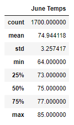
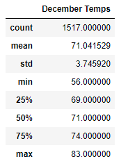

# Surf's Up Analysis

## Overview of Project:

Using Python, Pandas functions and methods, and SQLAlchemy to perform an analysis of Oahu temperatures to support opening a surf and ice cream shop in Oahu.  

### Purpose:

Using Python, Pandas functions and methods, and SQLAlchemy to perform an analysis of Oahu temperatures to support opening a surf and ice cream shop in Oahu.  A dataset including Oahu weather station temperature and precipitation readings for 2010 through 2017 was used to review temperature statistics for the months of June and December.

## Analysis Results and Challenges:

### Analysis of Outcomes 
Based on the statistics developed for weather temperatures isolated for the months of June and December, the following were found:

1. Comparing June and December temperatures, the mean (or average) temperature is not significantly different for the two months.  June mean temperature is 75 and December mean temperature is 71.  So surfing and ice cream demand should be fairly consistent and not peak/valley fluctuate based on average weather temperatures (since those averages temperatures do not vary significantly).

2. Even though the June temperatures min and max range is wide (64 - 85), the interquartile range is fairly small (4).  The first quartile (25th %) temperature is 73, the second quartile (50th %) temperature is 75, and the third quartile (75th %) temperature is 77.  

   Similarly, even though the December temperatures min and max range is wide (56 - 83), the interquartile range is fairly small (5).  The first quartile (25th %) temperature is 69, the second quartile (50th %) temperature is 71, and the third quartile (75%) temperature is 74.  

   As with the average temperatures described in #1 above, surfing and ice cream demand should be fairly consistent and not peak/valley fluctuate significantly based on weather temperatures alone, because the weather temperatures do no fluctuate widely between summer time (June) and winter time (December) based on the interquartile review.

3. The standard deviation for June temperatures is 3.26 and for December temperatures is 3.75.  These lower standard deviation values for June and December reflect that temperatures are clustered fairly close to the mean values noted in #1 above.  The low variability in the temperatures further reinforces the previous statements on minimal weather temperature fluctations leading to consistent surfing and ice cream demand versus only a single season desire or peak.

#### June Temperature Statistics Summary

    

#### December Temperature Statistics Summary

### Challenges and Difficulties Encountered

No challenges were encountered during the analysis. But assumptions or additional actions taken include:

* The additional two queries for June and December precipitation outlined in the Summary below have been included in the Jupyter Notebook but analysis for result/conclusion findings have not been included in the Summary.

## Summary

Analyzing the June and December weather temperature readings from 2010 through 2017 for Oahu reveals that weather temperatures for these two months do not fluctuate significantly.  Because the weather temperatures do not significantly fluctuate between seasons, if June signifies the summer season and December signifies the winter season, surfing and ice cream demand should be fairly consistent between seasons rather than peaking in one season (e.g. June summertime) and falling in another seaon (e.g. December wintertime).  Establishing a surf and ice cream shop on the island of Oahu, Hawaii is a good business plan and supported by the great, stable weather temperatures reviewed.

Additional queries can be executed to further review the Oahu weather conditions and verify the temperature related findings previously described.

* With the current dataset:
 
Review precipitation quantities for June and December.  High precipitation, even though the temperature is nice, could negatively impact customer flow.  Two additional queries to review precipitation in June and also in December have been included in the Jupyter Notebook to further review weather conditions in Oahu in June vs. December.

* If the current dataset was expanded:

Associate Oahu areas/regions with Station IDs:  By associating Oahu areas or regions to group the Station IDs within would help to focus location scouting for the surf and ice cream shop.  A query can then be created where the temperature and precipitation readings already captured associated to Station ID's can then be group to regional areas that would be optimal locations on Oahu to scout for the surf and ice cream shop location.
